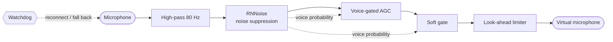

<p align="center">
  
</p>

<h1 align="center">Nivel</h1>

<p align="center">
  <b>Keep your microphone on the level.</b><br>
  No dropouts, no blasts, no whispers, in every app, on Windows, macOS and Linux.
</p>

<p align="center">
  <a href="https://github.com/machina-sports/nivel/actions/workflows/ci.yml"></a>
  
  
</p>

<p align="center"><a href="README.pt-BR.md">Leia em português</a></p>

---

*Nível* is Portuguese for "level", the bubble level a builder uses to get things straight. Nivel does that for your voice.

Calls, classes, streams and podcasts go wrong in the same three ways: **you are too quiet**, **something is suddenly too loud** (a laugh, a bump on the desk, a door), or **the mic silently stops working**. Nivel is a small, free, open source tool that fixes all three for any app you use, and runs entirely on your computer.

## What it fixes

| Problem | What Nivel does |
| --- | --- |
| **Too quiet, or the volume drifts** as you lean back | A voice-gated automatic gain control brings your speech to a steady level. It only adapts while you talk, so pauses never pump the room noise up. |
| **Sudden loud sounds** | A look-ahead limiter puts a hard ceiling on the output (−1 dBFS) and catches peaks *before* they arrive, so they don't crackle. |
| **Background noise**: fans, keyboards, traffic, hum | RNNoise neural noise suppression, plus a soft gate that turns down the gaps between words instead of chopping them. |
| **Mic gain too high**, so the mic itself clips | `nivel ride` lowers the system mic volume the instant clipping starts. |
| **No sound at all** | A watchdog spots muted mics, blocked permissions, unplugged or stalled devices. It reconnects by itself, uses another mic while yours is gone and switches back when it returns. |
| **"Is my mic even OK?"** | `nivel doctor` listens for 10 seconds and tells you in plain words what is wrong and how to fix it. |

## Quick start

```bash
nivel doctor   # 10-second check-up: level, noise, clipping, mute, dropouts
nivel ride     # keep the system mic volume right, for every app, no driver needed
nivel run      # full clean-up into a virtual microphone
```

### Two ways to use it

**`nivel ride`: no setup, works everywhere.** Nivel watches your voice and gently moves the operating system's own microphone volume slider until you sit at the right level. Every app benefits immediately, with nothing to install. It also unmutes a muted mic and pulls the volume down the moment you clip. It can't remove noise: for that, use `run`.

**`nivel run`: the full treatment.** Your mic goes through noise suppression, leveling, a soft gate and a limiter, and comes out of a *virtual microphone* that you select in Zoom, Meet, Teams, Discord, OBS or any other app.

| Platform | Virtual microphone |
| --- | --- |
| **Linux** (PulseAudio or PipeWire) | Created automatically as **"Nivel Microphone"** and removed when Nivel stops. |
| **macOS** | Install the free [BlackHole](https://existential.audio/blackhole/) driver (`brew install blackhole-2ch`), then pick **"BlackHole 2ch"** as the mic in your apps. |
| **Windows** | Install the free [VB-CABLE](https://vb-audio.com/Cable/) driver, then pick **"CABLE Output"** as the mic in your apps. |

> Tip: turn off "Automatically adjust microphone volume" in Zoom, Meet or Teams while Nivel runs, so two levelers don't fight each other.

## Install

**Prebuilt binaries** for Windows, macOS and Linux are attached to each [release](https://github.com/machina-sports/nivel/releases).

<details>
<summary>macOS says the binary "cannot be opened"</summary>

Release binaries are not notarized yet. After downloading, run `xattr -d com.apple.quarantine ./nivel` once. The first run asks for microphone permission for your terminal app; allow it in System Settings → Privacy & Security → Microphone.
</details>

**From source** with [Rust](https://rustup.rs) 1.88 or newer:

```bash
cargo install --git https://github.com/machina-sports/nivel nivel-cli
```

On Debian and Ubuntu, install the ALSA headers first: `sudo apt install libasound2-dev pkg-config`.

## Commands

| Command | What it does |
| --- | --- |
| `nivel devices` | Lists microphones and outputs, the system mic volume, and whether a virtual mic is ready. |
| `nivel doctor [-i MIC] [--seconds N]` | Listens, then reports voice level, background noise, clipping, mute, volume and dropouts, with fixes. Exits with code 2 when it finds a serious problem. |
| `nivel ride [-i MIC] [--target -24] [--max-volume 100] [--restore]` | Rides the system mic volume. `--restore` puts the original volume back on exit. |
| `nivel run [-i MIC] [-o OUTPUT] [--channel N]` | Processes your mic into the virtual mic (or into `-o OUTPUT`). `--channel 1` captures one input of a multi-input audio interface. |
| `nivel process IN.wav OUT.wav` | Runs the same chain over a recording and prints a before/after report. |

Microphones can be given by full name or any part of it: `-i "MacBook"`, `-i shure`, `-i "USB Audio"`.

### Tuning `run` and `process`

| Flag | Default | Meaning |
| --- | --- | --- |
| `--target` | `-20` | Speech level to aim for, in dBFS RMS. |
| `--max-gain` | `30` | Most boost a quiet voice may get, in dB. |
| `--strength` | `100` | Noise suppression strength, 0–100 %. Lower sounds more natural in quiet rooms. |
| `--gate` | `10` | How far to turn down the gaps between words, in dB. `0` turns the gate off. |
| `--ceiling` | `-1` | Hard output ceiling, in dBFS. |
| `--highpass` | `80` | Rumble filter cutoff, in Hz. `0` turns it off. |
| `--no-denoise`, `--no-agc` | | Turn a stage off. |

## How it works



- Audio is processed in 10 ms frames at 48 kHz. Microphones at other rates (44.1 kHz, 16 kHz Bluetooth headsets…) are resampled automatically.
- The audio callbacks only move samples through lock-free ring buffers; all processing happens on a separate thread, so a slow moment never blocks the sound card.
- The output is resampled with a slowly adjusted ratio, so the mic's and the virtual device's clocks never drift apart, even over hours.
- End-to-end latency in `run` is roughly 50 ms.
- **Everything runs locally.** No audio, telemetry or analytics ever leave your computer.

More detail in [docs/how-it-works.md](docs/how-it-works.md).

## Project layout

| Crate | Role |
| --- | --- |
| [`nivel-dsp`](crates/nivel-dsp) | Pure DSP: filter, noise suppression, AGC, gate, limiter, volume rider. No I/O, fully unit tested. |
| [`nivel-core`](crates/nivel-core) | Audio engine, device handling, watchdog and supervisor, OS volume control, virtual mic. |
| [`nivel-cli`](crates/nivel-cli) | The `nivel` command. |

## Roadmap

- [ ] Tray app with one-click on/off, live meter and presets
- [ ] Bundled virtual microphone driver (no BlackHole or VB-CABLE needed)
- [ ] Presets for calls, podcasts, streaming and gaming
- [ ] Echo cancellation for people who use speakers
- [ ] Signed and notarized releases, Homebrew, winget and Flathub packages

Ideas and pull requests are welcome; see [CONTRIBUTING.md](CONTRIBUTING.md).

## Questions and contact

Open an [issue](https://github.com/machina-sports/nivel/issues) for bugs and ideas, or write to Mateus Pinheiro at [mateus.pinheiro@machina.gg](mailto:mateus.pinheiro@machina.gg) for anything else.

## License

[MIT](LICENSE). Free to use, change and share, including commercially.

Noise suppression uses [nnnoiseless](https://github.com/jneem/nnnoiseless), a Rust port of [RNNoise](https://github.com/xiph/rnnoise) by Jean-Marc Valin (BSD-3-Clause). Audio I/O uses [cpal](https://github.com/RustAudio/cpal) and resampling uses [rubato](https://github.com/HEnquist/rubato).

---

<p align="center">Made with care by <a href="https://github.com/machina-sports">Machina Sports</a>, for everyone who has ever asked "can you hear me?"</p>
