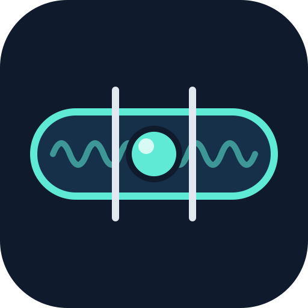

<p align="center">
  
</p>

<h1 align="center">Nivel</h1>

<p align="center">
  <b>Seu microfone sempre no nível.</b><br>
  Sem som sumindo, sem estouro, sem sussurro, em qualquer app, no Windows, macOS e Linux.
</p>

<p align="center"><a href="README.md">Read in English</a></p>

---

Chamadas, aulas, lives e podcasts dão errado de três jeitos: **você está baixo demais**, **algo fica alto de repente** (uma risada, uma batida na mesa, uma porta) ou **o microfone para de funcionar sem avisar**. O Nivel é uma ferramenta pequena, gratuita e open source que resolve os três, para qualquer app, rodando inteiramente no seu computador.

## O que ele resolve

| Problema | O que o Nivel faz |
| --- | --- |
| **Volume baixo ou oscilando** | Um controle automático de ganho guiado pela voz deixa sua fala num nível estável. Ele só se ajusta enquanto você fala, então as pausas nunca amplificam o ruído da sala. |
| **Sons altos repentinos** | Um limitador com *look-ahead* impõe um teto (−1 dBFS) e segura o pico *antes* de ele chegar, sem chiado. |
| **Ruído de fundo**: ventilador, teclado, trânsito, zumbido | Supressão de ruído neural (RNNoise) e um *gate* suave que abaixa os intervalos entre as palavras sem cortá-las. |
| **Ganho do mic alto demais** (o próprio mic distorce) | O `nivel ride` baixa o volume do microfone no sistema no instante em que começa a distorcer. |
| **Sem som nenhum** | Um *watchdog* detecta mic mutado, permissão bloqueada, dispositivo desconectado ou travado. Reconecta sozinho, usa outro mic enquanto o seu não volta e troca de volta quando ele reaparece. |
| **"Meu mic está ok?"** | O `nivel doctor` escuta por 10 segundos e explica em linguagem simples o que está errado e como corrigir. |

## Começo rápido

```bash
nivel doctor   # check-up de 10 s: nível, ruído, distorção, mudo, quedas
nivel ride     # mantém o volume do mic do sistema certo, para todo app, sem driver
nivel run      # tratamento completo num microfone virtual
```

- **`nivel ride`** não precisa instalar nada: ajusta o controle de volume do microfone do próprio sistema operacional.
- **`nivel run`** passa a voz por supressão de ruído, nivelamento, *gate* e limitador, e entrega num **microfone virtual** que você escolhe no Zoom, Meet, Teams, Discord, OBS etc.
  - **Linux**: o "Nivel Microphone" é criado automaticamente.
  - **macOS**: instale o [BlackHole](https://existential.audio/blackhole/) (`brew install blackhole-2ch`) e escolha "BlackHole 2ch" como microfone.
  - **Windows**: instale o [VB-CABLE](https://vb-audio.com/Cable/) e escolha "CABLE Output" como microfone.

> Dica: desligue o "ajustar volume do microfone automaticamente" do Zoom, Meet ou Teams enquanto o Nivel roda, para os dois não brigarem.

Tudo roda localmente: nenhum áudio, telemetria ou analytics sai do seu computador.

Instalação, comandos, ajustes finos e arquitetura estão no [README em inglês](README.md).

---

<p align="center">Feito com carinho pela <a href="https://github.com/machina-sports">Machina Sports</a>, para todo mundo que já perguntou "tá me ouvindo?"</p>
